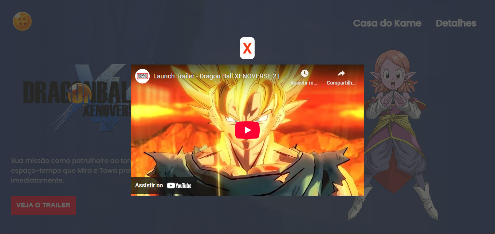

# 🎮 Projeto-dbx2 (História do Dragon Ball Xenoverse 2)


---

## 📖 Descrição

O **Projeto-dbx2** é um site temático que possui um breve sinopse da história de **Dragon Ball Xenoverse 2** e o trailer do jogo no youtube.  
O site foi construído com tecnologias web (HTML, CSS, JavaScript).  
O objetivo foi praticar front-end e compartilhar no portfólio.

---

## ⚙️ Pré-requisitos

Para rodar ou fazer modificações no projeto localmente, você precisará de:

- Navegador moderno (Chrome, Firefox, Edge, etc.)
- Editor de código (ex: VS Code, Sublime, etc.)
- Git (para clonar o repositório)
- (Opcional) Extensão "Live Server" do VS Code para atualização automática

---

## 🧩 Instalação / Clonagem

Clone o repositório para sua máquina:

```bash
git clone https://github.com/maurilio-santoss/Projeto-dbx2.git
cd Projeto-dbx2
```

---

## ▶️ Uso / Visualização

Abra o arquivo **index.html** no navegador.   
Ou abra via [**GitHub Pages**](https://maurilio-santoss.github.io/Projeto-dbx2/)

---

## 📄 Estrutura e telas

**Página Inicial**


**Trailer**



---

## 🤝 Contribuição

Se quiser contribuir:
1. Faça um fork deste repositório
2. Crie uma branch para sua feature:

```bash
git checkout -b feature/nome-da-feature
```

3. Faça commits com mensagens claras, seguindo padrão como feat:, fix:, docs:, etc.

4. Envie para o seu repositório remoto:

```bash
git push origin feature/nome-da-feature
```

5. Abra um Pull Request explicando as mudanças

**Normas sugeridas de commit**
- feat: novas funcionalidades
- fix: correção de bugs
- docs: mudanças na documentação
- style: formatação, lint
- refactor: reorganização de código
- test: adição/ajuste de testes

---

## 👥 Contribuidores / Owner

Obrigado a todos que contribuiram!   
   
| Avatar | Nome | Função | GitHub |   
|--------|------|--------|--------|   
|  | **Maurílio Santos** | Owner / Developer | [@maurilio-santoss](https://github.com/maurilio-santoss)